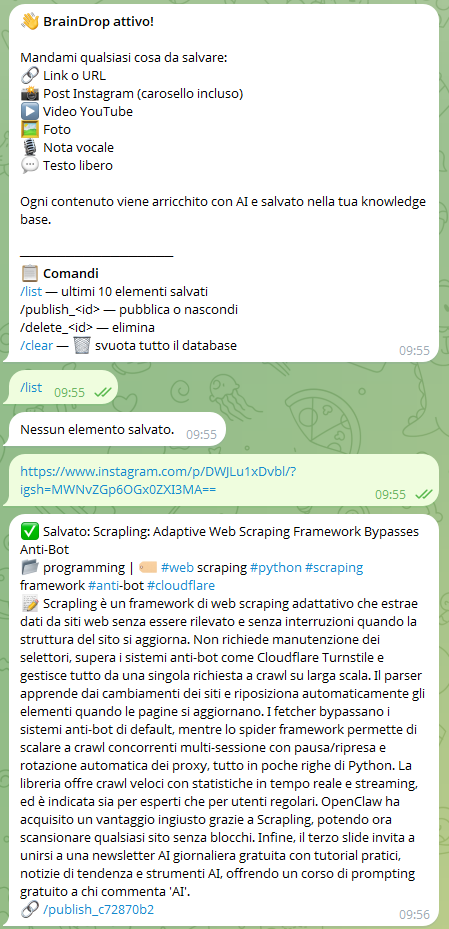
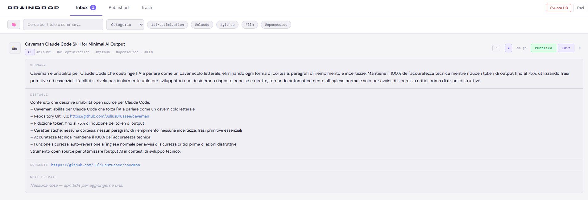

# 🧠 BrainDrop

> **Cattura tutto. Dimentica niente.**

BrainDrop è il tuo secondo cervello personale via Telegram. Mandi un link, un post Instagram, una foto, una nota vocale o un'idea — lui la analizza, la arricchisce con AI e la salva nella tua knowledge base. Un admin panel React ti permette di gestire, pubblicare e cercare tutto — anche per significato con la ricerca semantica.

---

## 📸 Screenshot

**Bot Telegram**



**Admin Panel**



---

## ✨ Come funziona

```
Tu mandi qualcosa su Telegram
        ↓
BrainDrop estrae il contenuto
        ↓
DeepSeek V3 analizza e arricchisce
        ↓
Salvato in Supabase con embedding vettoriale
        ↓
Admin panel React per cercare, pubblicare e modificare
```

---

## 📥 Cosa puoi mandare

| Input | Cosa succede |
|---|---|
| 🔗 **URL / articolo** | Scraping (Firecrawl) → entry strutturata |
| 📸 **Post Instagram** | Caption + OCR di ogni slide del carosello (GPT-4o-mini); Reel: trascrizione audio (Whisper) → testo completo |
| ▶️ **Video YouTube** | Metadati + trascrizione automatica → riassunto |
| 🖼 **Foto Telegram** | Descrizione visiva + OCR (GPT-4o-mini) → testo |
| 🎙 **Nota vocale** | Trascrizione (OpenAI Whisper) → testo |
| 💬 **Testo libero** | Analisi diretta → entry arricchita |

Ogni entry riceve: **titolo in inglese**, **riassunto narrativo in italiano**, **scheda schematica con tutti i dettagli** (repo, link, step), **categoria**, **tag**, **URL sorgente**, **embedding vettoriale** per la ricerca semantica.

---

## 🤖 Stack tecnico

| Layer | Tecnologia |
|---|---|
| Bot | python-telegram-bot |
| AI | DeepSeek V3 (Chat) via Agno |
| Embeddings | OpenAI text-embedding-3-small |
| Web scraping | Firecrawl |
| Web search | Tavily (last resort) |
| Vision / OCR | GPT-4o-mini (OpenAI) |
| Voice | Whisper (OpenAI) |
| Instagram | instaloader + yt-dlp (audio reel) |
| YouTube | Agno YouTubeTools (trascrizioni + metadata) |
| Database | Supabase (PostgreSQL + pgvector + RLS) |
| Admin panel | React 19 + Vite 5 + TanStack Query + shadcn/ui |

---

## 🚀 Setup

### 1. Clona e installa (bot)

```bash
git clone https://github.com/Attilio81/BrainDrop.git
cd BrainDrop
pip install -r requirements.txt
```

### 2. Variabili d'ambiente — bot

Crea il file `.env` nella root:

| Variabile | Dove trovarla |
|---|---|
| `TELEGRAM_BOT_TOKEN` | [@BotFather](https://t.me/BotFather) |
| `AUTHORIZED_USER_ID` | Il tuo ID Telegram → [@userinfobot](https://t.me/userinfobot) |
| `DEEPSEEK_API_KEY` | [platform.deepseek.com](https://platform.deepseek.com) |
| `TAVILY_API_KEY` | [app.tavily.com](https://app.tavily.com) |
| `FIRECRAWL_API_KEY` | [firecrawl.dev](https://firecrawl.dev) |
| `OPENAI_API_KEY` | [platform.openai.com](https://platform.openai.com) — Whisper + Vision OCR + Embeddings |
| `SUPABASE_URL` | Supabase → Settings → API |
| `SUPABASE_SERVICE_KEY` | Supabase → Settings → API → `service_role` |

### 3. Variabili d'ambiente — admin panel

Crea il file `admin/.env.local`:

```env
VITE_SUPABASE_URL=https://TUO_PROGETTO.supabase.co
VITE_SUPABASE_ANON_KEY=eyJ...la_tua_anon_key...
VITE_OPENAI_API_KEY=sk-...   # per la ricerca semantica nel pannello admin
```

### 4. Supabase — esegui le migrazioni

In **Supabase Dashboard → SQL Editor**, esegui in ordine:

```sql
-- 1. Schema iniziale (pgvector, tabella ideas, indici, RLS)
-- (incolla il contenuto di db/migrations/001_initial.sql)

-- 2. Aggiornamento source_type
-- (incolla il contenuto di db/migrations/002_phase2.sql)

-- 3. Policy RLS per admin panel (utenti autenticati)
-- (incolla il contenuto di db/migrations/003_admin_rls.sql)

-- 4. Colonna details (scheda schematica)
-- (incolla il contenuto di db/migrations/004_details_column.sql)

-- 5. Ricerca semantica — indice HNSW + funzione match_ideas()
-- (incolla il contenuto di db/migrations/005_pgvector_search.sql)
```

### 5. Avvia il bot

**Windows:** doppio click su `start.bat`

**Terminale:**
```bash
python -m bot.main
```

### 6. Avvia l'admin panel

**Windows:** doppio click su `start-admin.bat` (installa le dipendenze al primo avvio)

**Terminale:**
```bash
cd admin
npm install   # solo la prima volta
npm run dev
```

Apri [http://localhost:5173](http://localhost:5173), inserisci la tua email e clicca il magic link.

---

## 💬 Comandi Telegram

| Comando | Descrizione |
|---|---|
| `/start` | Mostra il messaggio di benvenuto |
| `/list` | Ultimi 10 elementi salvati |
| `/publish_<id>` | Pubblica o nascondi un elemento |
| `/delete_<id>` | Elimina (soft delete) |
| `/clear` | 🗑 Svuota tutto il database |

---

## 🖥 Admin Panel

Interfaccia React per gestire la knowledge base:

- **Inbox** — idee salvate, da rivedere e pubblicare
- **Published** — idee pubblicate, visibili al frontend
- **Trash** — idee eliminate, ripristinabili o cancellabili definitivamente

**Funzionalità:**
- Filtro per testo / categoria / tag
- **🧠 Ricerca semantica** — clicca il bottone 🧠 e cerca per significato, non per parola esatta (es. "agenti AI per sviluppo" trova anche idee taggate "llm workflow" o "developer tools")
- Pannello inline espandibile per ogni idea con: **Summary** (narrativo) + **Dettagli** (schematico con tutti gli item e link cliccabili) + **Sorgente** + **Note private**
- Edit modale con titolo, summary, categoria, tag, note private
- Pulsante Svuota DB

---

## 🗂 Struttura del progetto

```
BrainDrop/
├── bot/
│   ├── agents/
│   │   ├── coordinator.py    # Agno agent — DeepSeek V3 + Firecrawl + YouTubeTools (Tavily last resort)
│   │   ├── embeddings.py     # OpenAI text-embedding-3-small (Phase 5)
│   │   ├── instagram.py      # instaloader + GPT-4o-mini OCR (caroselli) + yt-dlp/Whisper (reel audio)
│   │   ├── photo.py          # GPT-4o-mini Vision
│   │   ├── voice.py          # OpenAI Whisper
│   │   ├── youtube.py        # yt-dlp (metadata fallback)
│   │   └── tools.py          # Firecrawl tool per Agno
│   ├── handlers.py           # Handler Telegram + fire-and-forget embedding
│   ├── config.py             # Configurazione (pydantic-settings)
│   └── main.py               # Entry point
├── db/
│   ├── client.py             # Wrapper Supabase async
│   ├── models.py             # Modelli Pydantic
│   └── migrations/
│       ├── 001_initial.sql   # Schema iniziale + pgvector + embedding column
│       ├── 002_phase2.sql    # Aggiornamento source_type
│       ├── 003_admin_rls.sql # Policy RLS per admin panel
│       ├── 004_details_column.sql  # Colonna details (scheda schematica)
│       └── 005_pgvector_search.sql # Indice HNSW + funzione match_ideas()
├── admin/                    # Admin panel React+Vite
│   ├── src/
│   │   ├── App.tsx           # Shell principale + auth guard + semantic search
│   │   ├── components/       # TabNav, FilterBar (🧠 toggle), IdeaRow, EditModal, LoginPage
│   │   ├── lib/              # Supabase client + TanStack Query hooks + useSemanticSearch
│   │   └── types.ts          # Tipi condivisi
│   └── .env.local            # Credenziali Supabase + OpenAI (non versionato)
├── start.bat                 # Avvio rapido bot (Windows)
├── start-admin.bat           # Avvio rapido admin panel (Windows)
└── Dockerfile
```

---

## 🛣 Roadmap

- ✅ **Phase 1** — Testo, URL, bot Telegram, Supabase
- ✅ **Phase 2** — Foto, note vocali (Whisper)
- ✅ **Phase 3** — Instagram (OCR caroselli + trascrizione audio reel), YouTube, admin panel React
- ✅ **Phase 5** — Ricerca semantica (pgvector + embedding per ogni idea)
- ⬜ **Phase 4** — Frontend pubblico
